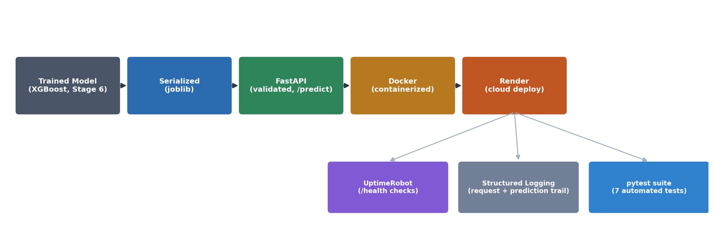

# Fraud Detection API

A credit card fraud detection model, trained on a severely imbalanced dataset (0.17% positive class), served as a deployed, monitored, tested REST API.



## Live Service

- **API base URL:** https://ml-roadmap.onrender.com
- **Interactive docs:** https://ml-roadmap.onrender.com/docs
- **Health check:** https://ml-roadmap.onrender.com/health

## What This Is

An XGBoost classifier trained on the Kaggle Credit Card Fraud dataset (284,807 transactions, 492 fraud), wrapped in a validated FastAPI service, containerized with Docker, deployed to Render, and covered by an automated pytest suite. Uptime is monitored externally via UptimeRobot pinging `/health`.

This project intentionally spans two stages of a self-directed ML roadmap:
- **Model development** (comparing raw XGBoost against `scale_pos_weight` and SMOTE for handling class imbalance) lives in [`06-applied-projects/04-fraud-detection`](../../06-applied-projects/04-fraud-detection)
- **Serving, deployment, and MLOps** (this folder) picks up from that model and takes it to production

## Model Performance

| Approach | Precision | Recall | F1 |
|---|---|---|---|
| Raw XGBoost (no imbalance handling) | 0.949 | 0.757 | 0.842 |
| XGBoost + `scale_pos_weight` | 0.903 | 0.757 | 0.824 |
| XGBoost + SMOTE | 0.143 | 0.865 | 0.246 |

**Raw XGBoost won** — the two imbalance-handling techniques either didn't help or actively hurt precision, an intentionally counterintuitive result worth highlighting rather than hiding: `scale_pos_weight` and SMOTE aren't automatic wins, and this dataset/model combination is direct evidence of that.

**Deployment threshold: 0.6** (not the default 0.5) — chosen because it strictly improves precision and F1 over the default with zero recall cost, given the cost asymmetry between a missed fraud case (real financial loss) and a false alarm (customer friction).

## Architecture

```
train_model.py  →  fraud_model.joblib + scaler.joblib
                              ↓
                           app.py  (FastAPI: /health, /predict)
                              ↓
                         Dockerfile  (containerized)
                              ↓
                      Render  (cloud deployment)
                        ↙        ↓        ↘
              UptimeRobot   api.log    test_app.py
              (uptime)      (logging)  (7 pytest tests)
```

## Project Structure

```
01-fraud-api/
├── train_model.py     # trains XGBoost, serializes model + scaler
├── app.py              # FastAPI service: /health, /predict, request validation, logging
├── test_api.py          # manual HTTP client for quick live testing
├── test_app.py           # automated pytest suite (in-process, no server needed)
├── Dockerfile
├── requirements.txt
├── .dockerignore
└── .gitignore
```

## Running Locally

```bash
python3 -m venv .venv
source .venv/bin/activate
python3 -m pip install -r requirements.txt

python3 train_model.py        # produces fraud_model.joblib and scaler.joblib
uvicorn app:app --reload      # starts the API at http://127.0.0.1:8000
```

Visit `http://127.0.0.1:8000/docs` for the interactive API explorer, or run `python3 test_api.py` in a separate terminal to send a sample request.

## Running with Docker

```bash
docker build -t fraud-api .
docker run -p 8000:8000 fraud-api
```

## Running Tests

```bash
python3 -m pip install pytest httpx
python3 -m pytest test_app.py -v
```

Covers: health check, valid prediction, response schema, probability range validation, missing-field rejection (422), wrong-type rejection (422), and a regression test on a known high-risk transaction.

## API Reference

### `GET /health`
Liveness check. Returns `{"status": "ok"}`.

### `POST /predict`
Takes a transaction's 30 features (`Time`, `V1`-`V28`, `Amount`) and returns:
```json
{
  "fraud_probability": 0.8245,
  "is_fraud": true,
  "threshold_used": 0.6
}
```
Malformed requests (missing or wrong-typed fields) are rejected with `422` before any model code runs, via Pydantic schema validation.

## What This Demonstrates

- Handling severe class imbalance, and evaluating multiple techniques honestly rather than assuming the more sophisticated one wins
- Defending a production decision threshold with a real cost-asymmetry argument, not the default
- Serializing a model for reuse outside the training process
- Building a validated, documented API around a model
- Containerizing for environment-independent deployment
- Deploying to a live cloud service
- External uptime monitoring
- Structured application logging
- Automated testing with a fast, in-process test client
