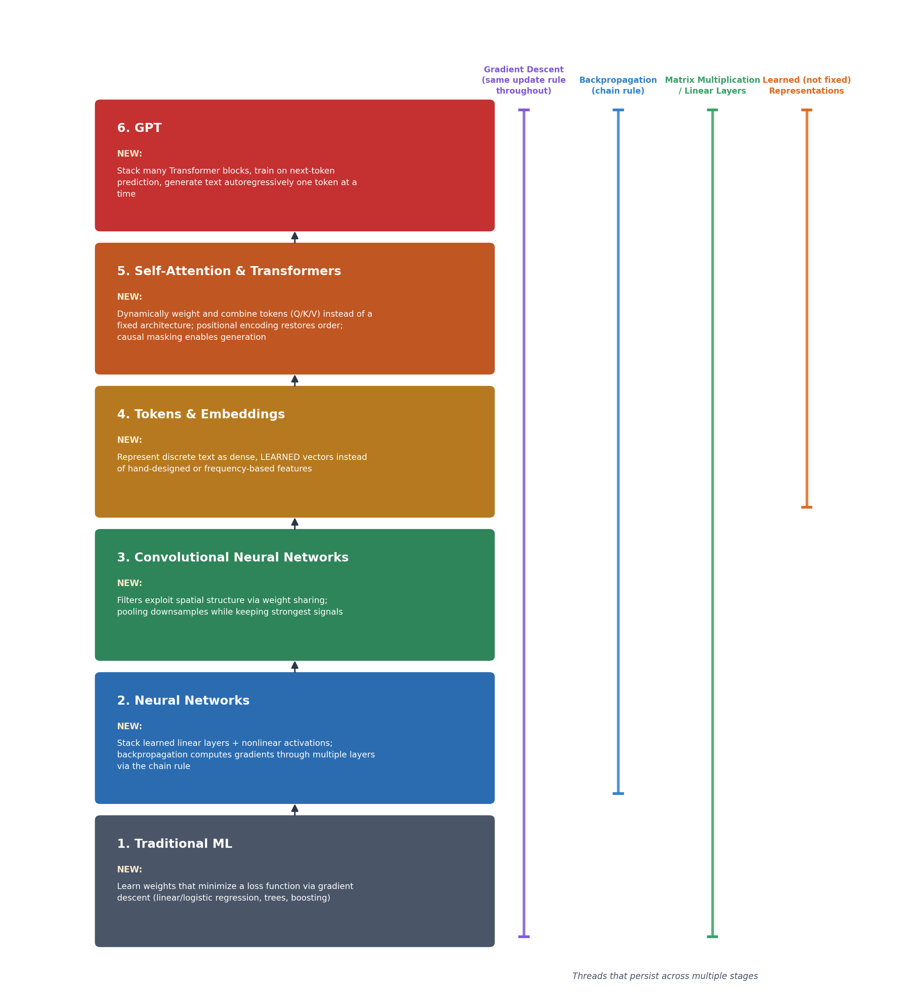

# ML Roadmap

A self-directed, project-driven curriculum covering machine learning from first principles through deployed, production ML systems: traditional ML, deep learning, and Transformers, each built from scratch before I used the corresponding library, culminating in a live deployed API.

## Goal

My goal was to build transferable ML skills, not just the ability to call an existing AI/LLM API. By the end of this roadmap, I wanted to be able to take a real-world problem and independently work through the full lifecycle: problem definition, data collection, EDA, feature engineering, baseline, model selection, training, evaluation, error analysis, improvement, deployment, and monitoring.

The principle I followed throughout: implement the core mechanic from scratch before reaching for the library version. I built gradient descent, backpropagation, and self-attention by hand in raw NumPy or PyTorch first, so that the library equivalent (`scaler.fit`, `loss.backward()`, `nn.MultiheadAttention`) read as automation of something I already understood, not unexplained magic.



## Repo Structure

```
00-crash-courses/          reference docs I wrote along the way (see below)
03-data-fundamentals/      Titanic: cleaning, leakage, feature engineering
04-traditional-ml/         linear and logistic regression from scratch
05-model-evaluation/       precision/recall, ROC, threshold tuning
06-applied-projects/       spam, recommender, churn, fraud detection
07-deep-learning/          neural nets from scratch, CNNs, optimizers
08-nlp-transformers/       tokenization through self-attention, GPT, fine-tuning
09-mlops/                  deployed, monitored, tested fraud API
10-ml-system-design/       not yet started
```

## Stage-by-Stage

### Stage 3: Data Fundamentals
I learned missing values, outliers, categorical encoding, feature engineering, train/val/test splitting, and the throughline of the entire roadmap: data leakage, and why every fitted transform (imputer, scaler, encoder, vocabulary) must be fit on training data only.

I built a cleaned Titanic pipeline, debugging through several real leakage bugs (a target-duplicate column, pre-split imputation) that I caught and fixed by hand.

By the end, I had the instinct to ask whether a metric could have seen data it shouldn't have before trusting it. That question resurfaced and caught real bugs in nearly every later stage.

### Stage 4: Traditional ML
I learned linear and logistic regression, implementing both from raw gradient descent before calling `sklearn.fit()`.

I built house price regression (California housing) and a Titanic survival classifier, each trained by hand and then cross-checked against scikit-learn.

This gave me a genuine understanding of what training a model actually is: the same `w -= learning_rate * dw` update rule that, I later found, still runs unchanged at the bottom of every model in this repo, including GPT.

### Stage 5: Model Evaluation
I learned confusion matrices, precision/recall/F1, ROC-AUC versus PR-AUC and why they diverge under imbalance, cross-validation, and threshold selection as a business decision rather than a default.

I built a full evaluation of the Titanic classifier, including a defended, non-default decision threshold with an explicit cost-asymmetry argument.

The recurring lesson I took from this stage: a single train/val split can overstate a model's real performance. I confirmed this directly later, when 5-fold cross-validation revealed the true accuracy was several points lower than the original split suggested.

### Stage 6: Applied Projects
I built four full projects, each introducing a genuinely different problem shape:

- **Spam classifier**: TF-IDF/Naive Bayes versus logistic regression, my first exposure to text features
- **Recommendation system**: MovieLens, a popularity baseline, SVD-based collaborative filtering, content-based filtering, and ranking metrics (precision@k) instead of classification metrics
- **Customer churn**: Telco dataset, `ColumnTransformer`/`Pipeline`, random forest, feature importances, and real error analysis
- **Fraud detection**: severe class imbalance (0.17% positive), XGBoost, `scale_pos_weight` versus SMOTE compared honestly (the simpler approach won), and a defended 0.6 threshold

Fraud detection became the flagship project of the whole roadmap. I later deployed it fully in Stage 9.

### Stage 7: Deep Learning
I learned the perceptron, forward and backward propagation, gradient descent variants (momentum, Adam), regularization (dropout, batch norm, weight decay), and CNNs.

I built a 2-layer neural network from scratch in raw NumPy, including a real debugging arc through numerical instability (`np.exp` overflow, a learning-rate/init-scale interaction, a silent stale-default-parameter bug). I then rebuilt the same architecture in PyTorch, followed by a CNN, both trained on MNIST.

I watched PyTorch's `loss.backward()` automate exactly the backward pass I had already implemented by hand. It read as recognition, not magic.

### Stage 8: NLP and Transformers
I learned tokenization, learned embeddings, self-attention (Q/K/V from raw matrix multiplies), positional encoding, causal masking, the full Transformer block, and GPT's autoregressive generation.

I built, in order:

1. Word-level tokenization and embeddings, compared directly against Stage 6's TF-IDF on the same spam dataset
2. Self-attention implemented from scratch on a toy example, then assembled into a full causally masked Transformer block
3. A working GPT, trained from scratch on tinyShakespeare (character-level), generating text via temperature and top-k sampling
4. DistilBERT fine-tuned on the same spam dataset, completing a three-way comparison across TF-IDF, from-scratch embeddings, and pretrained-and-fine-tuned

The same `TransformerBlock` class, unmodified, powers both a 4-token toy example and a real text-generating model. That was my concrete demonstration that scaling up a Transformer is mostly stacking and training volume, not new architecture.

### Stage 9: MLOps
I learned model serialization, API design with validation, containerization, cloud deployment, uptime monitoring, structured logging, and automated testing.

I took the Stage 6 fraud model all the way to a live, deployed system:

- Serialized it with `joblib`
- Served it via FastAPI with Pydantic-validated requests (422 rejection of malformed input, verified with automated tests)
- Containerized it with Docker, including the `$PORT`-binding fix required for cloud deployment
- Deployed it live on Render
- Monitored it for uptime via UptimeRobot pinging `/health`
- Added structured logging of every prediction request
- Wrote a 7-test automated `pytest` suite, including a regression test locking in expected model behavior

The result is a complete, professional-quality deployed ML system. See [`09-mlops/01-fraud-api`](09-mlops/01-fraud-api) for the full README, architecture diagram, and live URL.

### Stage 10: ML System Design (not yet started)
This stage covers architecting full systems on paper: a fraud pipeline, a recommendation engine, an LLM-powered application, synthesizing everything above into system-level, interview-ready diagrams. I'm saving it deliberately for later.

## 00-crash-courses/

Alongside the hands-on work, I wrote reference documents tied to whichever notebook prompted them: math foundations, supervised versus unsupervised learning, linear/logistic regression, deep learning fundamentals, PyTorch and CNNs, optimizers and regularization, tokens and embeddings, self-attention and Transformers, GPT internals, a full "ML to GPT" big-picture synthesis (the diagram at the top of this README), and an interview-prep Q&A sheet.

## Skills Demonstrated

**Modeling:** linear/logistic regression, decision trees, random forest, XGBoost, Naive Bayes, k-means-adjacent collaborative filtering, feedforward networks, CNNs, Transformers, GPT

**Engineering:** pandas, NumPy, scikit-learn, PyTorch, HuggingFace `transformers`, FastAPI, Docker, pytest

**Practices:** leakage-free pipelines, class-imbalance handling, cross-validation, defended threshold selection, structured error analysis, reproducible environments, containerized deployment, automated testing

## A Note on the Debugging

Nearly every stage above includes at least one real bug I caught and fixed, not staged for teaching purposes but genuine issues I hit during the work: a target-leakage column, stale kernel state silently reusing an old model, a tuple accidentally stored where a float was expected, a learning-rate default silently overriding an intended value, a scaler misapplied to a single inference-time row, and a `numpy` overflow in a hand-written sigmoid. I preserved each of these in the relevant notebook's history rather than quietly cleaning them up. The debugging is as much a part of this roadmap as the working code.
